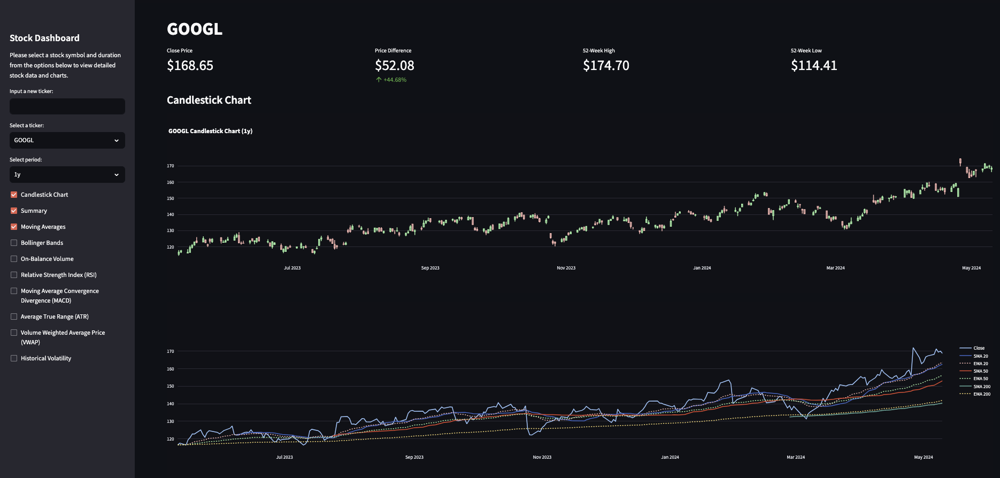

Stock Dashboard
===============================

The Stock Dashboard is a Streamlit-based web application designed to provide interactive visualizations and analytics for stock data using the IEX Cloud API https://iexcloud.io/. The application allows users to view candlestick charts, moving averages, Bollinger Bands, and various other financial indicators.

## Features

- **Flexible Ticker Selection**: Choose from a predefined list of popular stock symbols via a dropdown menu or enter a new ticker symbol directly to fetch data.
- **Customizable Time Range**: Adjustable display period
- **Dynamic Financial Charts**: Includes Candlestick charts, Moving Averages, Bollinger Bands, OBV, RSI, MACD, ATR, VWAP, and Historical Volatility.
- **Data Export**: After selecting features from the checkboxes and adjusting the duration, a csv file is read to download with the configurations.

## Prerequisites

Before you can run the application, ensure you have the following installed:
- Python 3.8+
- Pip (Python package installer)
- IEX Cloud API (First free trial for 7 days). This enables real time data stream (faster than yfinance or similar package)

## Screenshot




## Installation

1. **Clone the Repository**

   To get started, clone this repository to your local machine using the following command:

```bash
git clone https://github.com/tranhlok/stock-dashboard.git
cd stock-dashboard
```
2. **Set Up a Virtual Environment** (optional but recommended)

Create a new virtual environment by running:

```bash
python -m venv venv
```

OR

```bash
python3 -m venv venv
```

Activate the virtual environment:
- On Windows:
  ```bash
  .\venv\Scripts\activate
  ```
- On macOS and Linux:
  ```bash
  source venv/bin/activate
  ```


3. **Install Dependencies**

Install the required Python packages with pip:

```bash
pip install -r requirements.txt
```
## Configuration

To run the application, you will need to set up your IEX Cloud API credentials. Create a file named `.streamlit/secrets.toml` in your project directory and add your API key as follows:


```bash
[api]
iex_key = "your_iex_api_key_here"
```
## Running the Application

After installation and configuration, run the application using Streamlit:


```bash
streamlit run StockDashboard.py

```

The application should now be running and accessible through your web browser at `http://localhost:8501`.


## Contributing

Contributions to the Stock Dashboard are welcome. Please feel free to fork the repository, make changes, and submit pull requests. You can also open issues if you find bugs or have suggestions.

```

 (                                     
 )\ )             *   )                
(()/(           ` )  /((      )        
 /(_)) (    (    ( )(_))(  ( /(  (     
(_))   )\   )\  (_(_()|()\ )(_)) )\ )  
| |   ((_) ((_) |_   _|((_|(_)_ _(_/(  
| |__/ _ \/ _|    | | | '_/ _` | ' \)) 
|____\___/\__|    |_| |_| \__,_|_||_|  
                                       
                                                                                                                                                         
```
